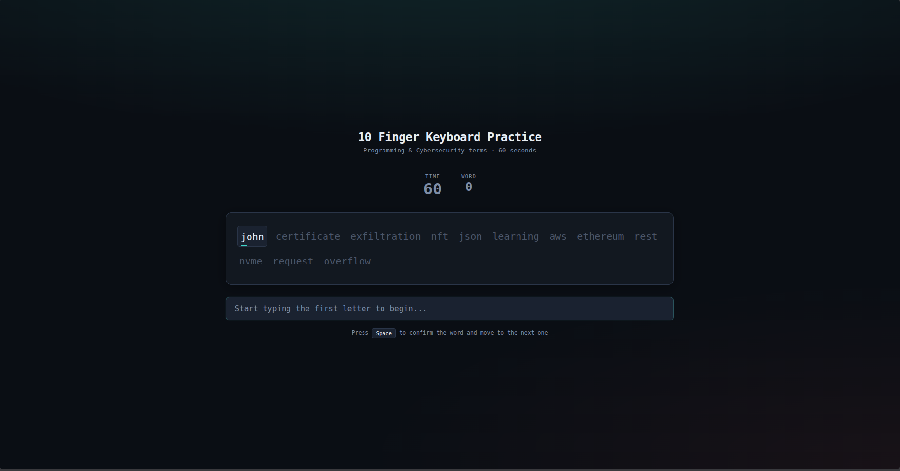

# Cyber Typing - 10-Finger Typing Game 🚀

A minimalist, dark-themed 10-finger typing practice game built specifically for software developers and cybersecurity enthusiasts. 

You can try the live version here: [omeraslan.dev/keyboard](https://omeraslan.dev/keyboard)

## 🎯 Features
* **Tech & Cyber Terms:** Practice using real-world tech vocabulary (e.g., `kernel`, `exploit`, `firewall`, `python`).
* **60-Second Challenge:** Test your typing speed with an automatic 1-minute countdown timer.
* **Live Feedback:** Real-time visual feedback (letters turn **green** for correct typing and **red** for mistakes).
* **Detailed Stats:** Displays your **WPM** (Words Per Minute) and **Accuracy** percentage at the end of the game.
* **Modern Dark Theme:** Clean and eye-friendly interface for long practice sessions.

## 🛠️ How to Play
1. Open the website.
2. Start typing the first word. The timer will start automatically on your first keystroke.
3. Press the **Spacebar** after each word to move to the next one.
4. Check your final score after 60 seconds and try to beat your high score!

## 💻 Tech Stack
* Pure HTML5
* Pure CSS3
* Vanilla JavaScript
